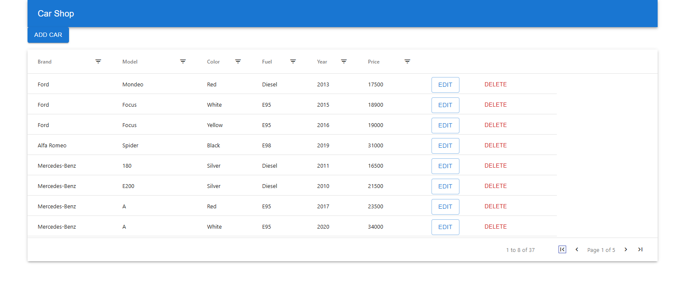

# CarShop - React Car Management Application

A modern React application for managing car inventory with a clean Material UI interface.



## Features

- **Car Management**: Add, edit, and delete cars in the inventory
- **Data Visualization**: View cars in a sortable and filterable table
- **Responsive Design**: Works on desktop and mobile devices
- **Real-time Notifications**: Get feedback on actions with toast notifications
- **Error Handling**: Graceful error handling with user-friendly messages

## Technologies Used

- **React 18**: Modern React with hooks for state management
- **Material UI**: Beautiful and responsive UI components
- **AG Grid**: Advanced data table with sorting and filtering
- **Vite**: Fast development server and optimized builds
- **Fetch API**: For communication with the backend service

## Getting Started

### Prerequisites

- Node.js 16+ and npm/yarn

### Installation

1. Clone the repository:

   ```bash
   git clone https://github.com/yourusername/carshop.git
   cd carshop
   ```

2. Install dependencies:

   ```bash
   npm install
   ```

3. Create an `.env` file in the root directory with your API URL:
   ```
   VITE_API_URL=https://car-rest-service-carshop.2.rahtiapp.fi/cars
   ```

### Running the Application

Start the development server:

```bash
npm run dev
```

The application will be available at http://localhost:5173 (or another port if 5173 is in use).

### Building for Production

Generate a production build:

```bash
npm run build
```

The built files will be in the `dist` directory.

## Usage Guide

### Viewing Cars

- The main view shows a table of all cars in the database
- Use the grid headers to sort or filter cars by any column

### Adding a Car

1. Click the "Add Car" button at the top of the page
2. Fill in the required details in the form
3. Click "Save" to add the car to the inventory

### Editing a Car

1. Find the car you want to edit in the table
2. Click the "Edit" button in that row
3. Update the details in the form
4. Click "Save" to update the car information

### Deleting a Car

1. Locate the car you want to remove in the table
2. Click the "Delete" button in that row
3. Confirm the deletion in the dialog

## API Connection

The application connects to a REST API backend. The endpoint is configured via the `VITE_API_URL` environment variable.

The API should support the following operations:

- GET - Fetch all cars
- POST - Add a new car
- PUT - Update an existing car
- DELETE - Remove a car

## Project Structure

```
carshop/
├── public/              # Static assets
├── src/
│   ├── assets/          # Images and other assets
│   ├── components/      # React components
│   │   ├── AddCar.jsx   # Component to add new cars
│   │   ├── CarList.jsx  # Main car listing component
│   │   ├── EditCar.jsx  # Component to edit existing cars
│   │   └── ...
│   ├── carapi.js        # API service functions
│   ├── App.jsx          # Main application component
│   └── main.jsx         # Application entry point
├── .env                 # Environment variables
├── eslint.config.js     # ESLint configuration
├── package.json         # Project dependencies
└── vite.config.js       # Vite configuration
```

## Troubleshooting

### Common Issues

1. **Cars not loading**

   - Check that the API URL is correct in `.env`
   - Verify the backend service is running
   - Check browser console for error messages

2. **Form submission errors**

   - Ensure all required fields are filled
   - Check that the input formats are correct
   - Verify network connectivity

3. **Styling issues**
   - Clear browser cache
   - Ensure all dependencies are correctly installed

## Contributing

1. Fork the repository
2. Create a feature branch: `git checkout -b feature-name`
3. Commit your changes: `git commit -m 'Add some feature'`
4. Push to the branch: `git push origin feature-name`
5. Submit a pull request

## License

This project is licensed under the MIT License - see the LICENSE file for details.

## Acknowledgements

- [React](https://reactjs.org/)
- [Material UI](https://mui.com/)
- [AG Grid](https://www.ag-grid.com/)
- [Vite](https://vitejs.dev/)
